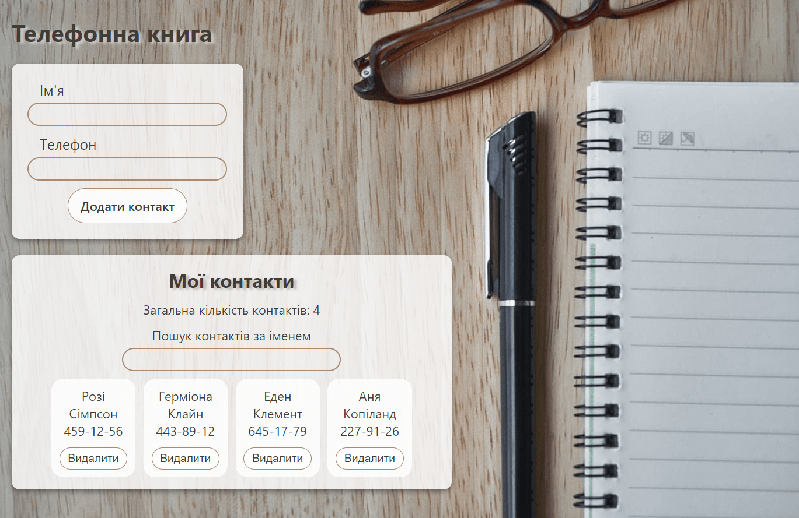

# Книга контактів
Додано зберігання контактів телефонної книги в localStorage, використовуючи методи життєвого циклу.

Під час додавання та видалення контакту контакти зберігаються у локальне сховище.
Під час завантаження застосунку контакти, якщо такі є, зчитуються з локального сховища і записуються у стан.

